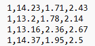
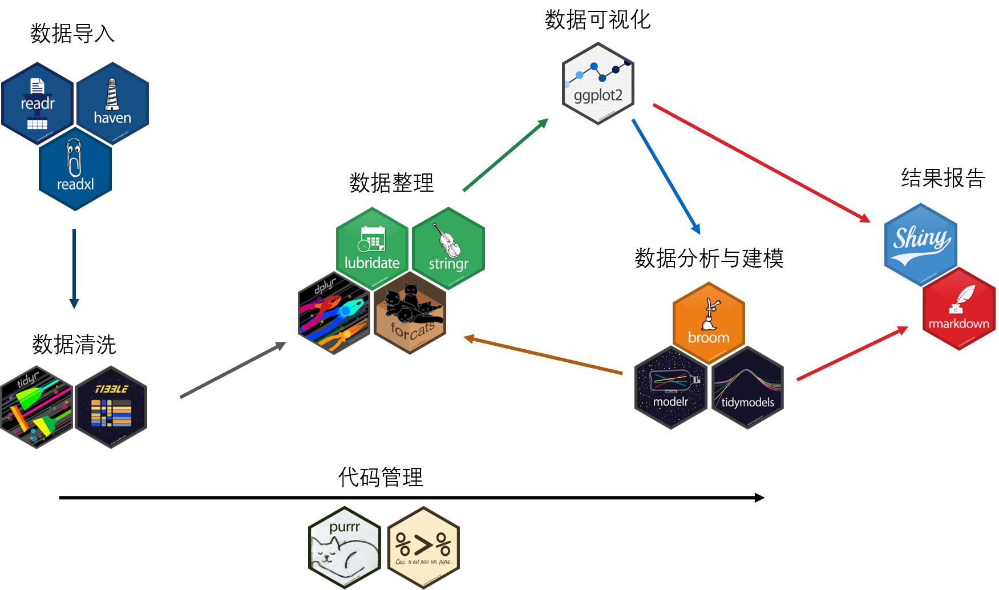
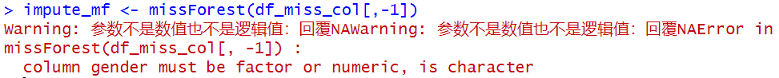
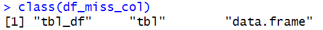
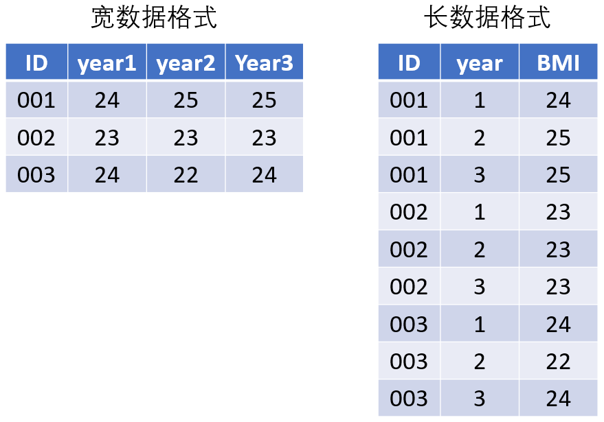

---
output:
  # pdf_document: default
  html_document: default
---

# 数据导入、导出与预处理

## 数据导入

### CSV文件读取

CSV（comma-separated values）文件是以`.csv`结尾的文件，文件中的数据以`,`分隔，每一行代表一条记录。如



读取csv文件或者以类似格式存储数据的txt文件时，可以使用`read.csv()`函数。

***注意***：在输入文件路径时，需要使用`\\`或者`/`。

```{r chapter2-load-csv}
# 读取数据
wine_df <- read.csv("data/wine.csv") # 或者 read.csv("data\\wine.csv")

# 显示前5行记录
head(wine_df, 5)
```

在上例中可以看到，`read.csv()`默认将第一行记录读取为变量名。如果不将第一行读取为变量名 ，可以声明参数`header=FALSE`，这时，变量名将自动生成（“V1”,“V2”...）。

```{r chapter2-load-csv-2}
# 读取数据
wine_df <- read.csv("data/wine.csv", header=FALSE)

# 显示前5行记录
head(wine_df, 5)
```

有些文件中的数据会以`,`当做千位分隔符，数据以`;`分隔，这时可以用`read.csv2()`函数。

```{r chapter2-load-csv-3}
# 读取数据
revenue_df <- read.csv2("data/revenue.txt")

# 显示前5行记录
head(revenue_df, 5)
```

### excel文件读取

excel文件的读取可以使用`readxl`包的`read_excel()`函数。此函数默认读取第一个工作表，如果需要读取特定工作表，可以声明`sheet`变量。

```{r chapter2-excel}
# 加载包
library(readxl)

# 读取数据
goods_df <- read_excel("data/goods.xlsx")

# 显示前5行记录
head(goods_df,5)
```

读取一个excel文件中的多个工作表。

```{r chapter2-excel-2}
# 返回"goods.xlsx"工作表名称
sheets <- excel_sheets("data/goods.xlsx") 

# 读取每个工作表为数据框并返回列表
multi_df <- lapply(sheets, function(x){read_excel("data/goods.xlsx", sheet=x)}) 

# 给列表的元素命名
names(multi_df) <- sheets 

# 查看生成的列表长度（每个元素对应一个工作表）
length(multi_df) 

# 显示Year2020工作表前5行记录
head(multi_df$Year2020,5) 
```

### 文件读取汇总

| 文件类型                     | 调用包         | 读取函数     |
|:-----------------------------|:---------------|:-------------|
| CSV文件（\*.csv）            | utils（R自带） | read.csv()   |
| TXT文件（\*.txt）            | utils（R自带） | read.csv()   |
| excel文件（\*.xlsx或\*.xls） | readxl         | read_excel() |
| SAS文件（\*.sas7bdat）       | haven          | read.sas()   |
| SPSS文件（\*.sav）           | haven          | read.sav()   |
| STATA文件（\*.dta）          | haven          | read_dta()   |

## 数据导出

| 数据导出类型                 | 导出时调用包   | 导出函数      | 读取时调用包   | 读取函数     |
|:------------------|:-------------|:-------------|:-------------|:-------------|
| R数据文件（\*.Rdata）        | base（R自带）  | save()        | base（R自带）  | load()       |
| CSV文件（\*.csv）            | utils（R自带） | write.csv()   | utils（R自带） | read.csv()   |
| 自定义文件（\*.csv或\*.txt） | utils（R自带） | write.table() | utils（R自带） | read.csv()   |
| excel文件（\*.xlsx）         | WriteXLS       | WriteXLS()    | readxl         | read_excel() |

```{r chapter2-export}
# 将goods_df导出为goods.csv文件，导出位置为D盘
# row.names=FALSE时将不会导出数据索引值
# write.csv(goods_df, "D:/goods.csv", row.names=FALSE) # 注意：此行代码在线上书中将不会执行
```

## 路径

我们在读取文件时，可以使用文件完整的存储路径，比如`D:/a-quick-start-on-data-analysis-in-r/data/goods.xlsx`，它能帮助我们找到任意位置上的文件，这条路径被称**绝对路径（absolute directory）**。

有时，文件的绝对路径很长，而且我们需要处理的文件一般都集中在特定文件夹下，这时，为了避免代码冗长，我们可以先设定一个工作路径，告诉R在查找文件时只查找存储在这个工作路径下的文件。这样，当我们要调用特定文件时，只需要调用该文件在<u>当前工作路径</u>下的路径，这条路径被称为**相对路径（relative directory）**。例如，当我们将`D:/a-quick-start-on-data-analysis-in-r`设置为工作路径，这时，如果要调用`goods.xlsx`，只需要输入路径`data/goods.xlsx`即可。

我们可以使用`getwd()`函数来获取当前的工作路径，使用`setwd()`设置新的工作路径。

***注意***：

<li>在设置了工作路径后，数据或图片的**存储**与**读取**都会默认在<u>该工作路径</u>下进行。</li>

<li>需要读取存储在其它路径的数据时，需要使用**绝对路径**。</li>

## 数据预处理

### tidyverse包

***tidyverse***包是R中的一个功能强大的数据处理包[大集合](https://tidyverse.tidyverse.org/)，包含***readr***、***haven***和***readxl***（数据读取与导出），***tidyr***（数据清洗），***dplyr***（数据整理），***stringr***（字符处理），***ggplot2***（数据可视化）等。

利用***tidyverse***包可以通过管道符`%>%`（快捷键`shift`+`ctrl`+`m`）对数据进行链式操作，从而对数据连续处理。



### 批量读取数据

有时我们需要对特定文件夹下面的特定类型（或者特定名称）文件进行**批量读取**，这时可以通过`list.files()`+`map_dfr()`函数实现。

```{r chapter2-directory, warning=FALSE, message=FALSE, error=FALSE}
# 加载包
library(tidyverse)

# 获取data文件夹下的所有txt文件名
txt_names <- list.files(path="data", pattern="txt", full.names=TRUE)

# 批量读取txt文件并存储为一个数据框
# 调用tidyverse的map_dfr()函数，由于获取的txt文件使用;分隔符，所以用read_csv2()函数读取每个文件
df_batch <- map_dfr(txt_names, read_csv2) 

# 显示前5行记录
head(df_batch,5)

# 显示后5行记录
tail(df_batch,5)
```

***注意***：

<li>读取的数据是垂直堆叠（vertical stack）。</li>

<li>读取数据的变量名如果一致，则数据会放在同一列；如果不一致，则会另外创建列变量。</li>

### 数据合并

有时我们有多个数据框，包含了不同的变量数据，在进行数据预处理与分析之前，需要使用`*_join()`函数将它们合并为一个数据框。

::: {align="center"}

:::

数据的合并依照**键（key）**进行，合并方式：

<li>内连接（inner_join）：保留两个数据键相同的记录并进行合并。</li>

<li>左连接（left_join）：保留左侧数据（X）的所有记录，右侧数据（Y）的键跟左侧数据相同的，才进行合并，左侧数据缺失值标记为`NA`。</li>

<li>右连接（right_join）：保留右侧数据（Y）的所有记录，左侧数据（X）的键跟右侧数据相同的，才进行合并，右侧数据缺失值标记为`NA`。</li>

<li>全连接（full_join）：保留两个数据中的所有记录并进行合并，缺失值标记为`NA`。</li>

<li>半连接（semi_join）：保留左侧数据（X）中与右侧数据（Y）的键相同的记录。</li>

<li>反连接（anti_join）：保留左侧数据（X）中与右侧数据（Y）的键不同的记录。</li>

```{r chapter2-join, warning=FALSE, message=FALSE, error=FALSE}
# 设置随机种子
set.seed(1)

# 创建左侧数据框
df_left <- data.frame(
  ID = seq(5),
  region = rep(c("South", "North"), times=c(3,2)),
  gender = rep(c("F","M"), times=c(3,2)), 
  value = rnorm(5)
)

# 创建右侧数据框
df_right <- data.frame(
  ID = seq(3,7),
  region = rep("South", times=5),
  sex = rep(c("M","F"), times=c(3,2)), 
  value = rnorm(5)
)

# 单键合并
df_single_key_join <- inner_join(df_left, df_right, by="ID")
# 默认左右侧变量分别加".x"和".y"标注
df_single_key_join 

# 多键合并
df_multi_key_join <- inner_join(df_left, df_right, by=c("ID", "region"))
df_multi_key_join
```

当目标数据框的键名相同时，可以使用上述合并函数。当目标数据框的键名不同时，可以使用`merge()`函数并声明`by.x`和`by.y`参数达到数据合并的效果。

```{r chapter2-merge, warning=FALSE, message=FALSE, error=FALSE}
# 不同键名的多键合并
df_diff_key_join <- merge(df_left, df_right, by.x=c("ID", "gender"), by.y=c("ID", "sex"))
df_diff_key_join

# 内连接
df_inner_join <- merge(df_left, df_right, by="ID")
df_inner_join

# 左连接
df_left_join <- merge(df_left, df_right, by="ID", all.x=TRUE)
df_left_join

# 右连接
df_right_join <- merge(df_left, df_right, by="ID", all.y=TRUE)
df_right_join

# 全连接
df_full_join <- merge(df_left, df_right, by="ID", all=TRUE)
df_full_join
```

当有多个数据框需要合并时，可以先将数据框放入一个列表中，再使用`reduce()`函数合并。

```{r chapter2-list-join}
# 将数据框放入列表中
df_list <- list(df_diff_key_join, df_inner_join, df_left_join, df_right_join)

# 多数据框合并
df_list_join <- df_list %>% reduce(inner_join, by="ID")
df_list_join
```

### 数据清洗

数据清洗是数据预处理的第一步，包括变量选择，变量重命名，缺失值处理，重复值删除等。

#### 变量选择

变量的选择可以使用`select()`函数，`()`内直接填写变量名称或者变量的索引值。详细介绍参考[此链接](https://dplyr.tidyverse.org/reference/select.html)。

```{r chapter2-variable-select, message=FALSE}
# 读取数据
df_darwin <- read_csv("data/darwin.csv")

# 选取 air_time1 和 gender 变量
df_darwin %>% select(air_time1, gender) %>% head()

# 选取除 air_time1 和 gender 之外的所有变量
df_darwin %>% select(!c(air_time1, gender)) %>% head()
```
使用`starts_with()`选取以特定字符开头的变量。
```{r chapter2-variable-select-starts-with}
# 选取以 air 或 max 开头的变量
df_darwin %>% select(starts_with(c("air", "max"))) %>% head()
```
使用`match()`选取符合特定正则表达式的变量。
```{r chapter2-variable-select-match}
# 选取名称中包含 extension4 和 extension5 的变量
df_darwin %>% select(matches("extension[45]")) %>% head()
```
使用`num_range()`选取以特定范围的数字结尾的变量。注意，数字的前缀必须为完整的变量名。
```{r chapter2-variable-select-num-range}
# 选取名称中 max_x_extension3、max_x_extension4 和 max_x_extension5 的变量
df_darwin %>% select(num_range("max_x_extension", 3:5)) %>% head()
```
#### 变量重命名

变量的重命名可以使用`rename()`函数，`()`内填写`新名称=旧名称`。

```{r chapter2-variable-rename}
# 将 gender 重命名为 sex
df_darwin %>% select(air_time1, gender) %>% rename(sex=gender) %>% head()
```

#### 缺失值处理

在进行缺失值处理前，我们需要了解各个变量的缺失值情况。

```{r chapter2-missing-value-sum, message=FALSE}
# 读取数据
df_miss <- read_csv("data/darwin-missing.csv") 

# 获取各变量的缺失数
apply(df_miss, 2, function(x) {sum(is.na(x))}) 
```

通常而言，对于缺失比例**大于20%**的变量，我们倾向于将该变量剔除。

```{r chapter2-missing-value-drop-col}
# 获取各变量的缺失数
col_miss_count <- apply(df_miss, 2, function(x) {sum(is.na(x))}) 

# 保留缺失占比不超过20%的变量
df_miss_col <- df_miss[, col_miss_count/nrow(df_miss) <= 0.2] 
```

对于有缺失值的记录，我们可以<u>删除</u>或者进行<u>缺失值填补</u>。

仅对所有变量均缺失的记录进行删除。

```{r chapter2-missing-value-full-miss}
# 除去第一个ID变量，其余变量都有缺失的记录将被删除
df_miss_col %>% filter(if_any(c(2:ncol(df_miss_col)), ~!is.na(.)))
```

对任意变量有缺失的记录进行删除。

```{r chapter2-missing-value-any-miss}
# 除去第一个ID变量，任意变量中有缺失的记录将被删除
df_miss_col %>% filter(if_all(c(2:ncol(df_miss_col)), ~!is.na(.x)))

# 任意变量中有缺失的记录将被删除
df_miss_col %>% drop_na()

```

对特定变量有缺失的记录进行删除。

```{r chapter2-missing-value-specified-miss}
# gender变量中有缺失的记录将被删除
df_miss_col %>% filter(!is.na(gender))
```

使用**均值**填补缺失值。

```{r chapter2-imputation-mean}
# 获取均值以便比较
mean(df_miss_col$air_time1, na.rm=TRUE) # 3857.5
mean(df_miss_col$gmrt_in_air1, na.rm=TRUE) # 261.9154

# 对连续型变量进行填补
df_miss_col %>% mutate_if(is.double, ~replace_na(.x, mean(.x, na.rm=TRUE)))

# 第二种写法，将`~`替换成function(){}形式
df_miss_col %>% mutate_if(is.double, function(x){replace_na(x, mean(x, na.rm=TRUE))})

# 第三种写法，直接列举变量名
df_miss_col %>% mutate_at(c("air_time1","gmrt_in_air1"), function(x) {replace(x, is.na(x), mean(x, na.rm = TRUE))})
```

使用**中位数**填补缺失值。

```{r chapter2-imputation-median}
# 获取中位数以便比较
median(df_miss_col$air_time1, na.rm=TRUE) # 3730
median(df_miss_col$gmrt_in_air1, na.rm=TRUE) # 257.9971

# 对连续型变量进行填补
df_miss_col %>% mutate_if(is.double, ~replace_na(.x, median(.x, na.rm=TRUE)))
```

使用**众数**填补缺失值。

```{r chapter2-imputation-mode}
# 构建众数函数
mode <- function(x) {
  ux <- unique(x) # 获取无重复元素的向量
  ux[which.max(tabulate(match(x, ux)))] # 获取众数
}

# 对字符型变量进行填补
df_miss_col %>% mutate_if(is.character, ~replace_na(.x, mode(.x)))
```

使用***mice***包对缺失值进行**多重插补（multiple imputation）**。

多重插补法假设缺失值是<u>随机发生</u>的，使用<u>链式方程</u>对缺失值进行填补，[具体步骤](https://www.ncbi.nlm.nih.gov/pmc/articles/PMC8499698/)为：

1.  从变量的实际观测值中随机取值对对应变量的缺失值进行填补。
2.  移除第一个缺失变量中有缺失值的记录，以第一个缺失变量为因变量，其余变量为自变量构建回归方程，通过随机回归插补法（即在构建的回归方程中添加扰动项`norm()`）填补第一个缺失变量的缺失值。
3.  以类似的方法对剩余缺失变量的缺失值进行填补。
4.  步骤2和3完成1次为1个循环（iteration）。通常重复5-20个循环构建一组填补后的数据。
5.  重复步骤4直至获得 m 组填补后的数据。<font color="red">*缺失值填补部分到此结束*</font>
6.  对 m 组数据分别进行统计分析，返回统计分析的平均结果。<font color="red">*此步骤为后续统计分析过程*</font>

具体操作可参考[这篇文章](https://zhuanlan.zhihu.com/p/36436260)。

```{r chapter2-imputation-mice, message=FALSE, warning=FALSE, error=FALSE}
# 加载包
library(mice)

# 数据处理
df_miss_col <- df_miss_col %>%
  filter(!is.na(gender)) %>% # gender变量中有缺失的记录将被删除
  mutate(gender=as_factor(gender)) # 将gender变量类型从字符型转换为分类变量

# 使用"pmm"法插补缺失值
impute_mice <- mice(df_miss_col, method="pmm", printFlag=FALSE, seed=1)

# 使用插补后的数据进行逻辑回归
fit_mice <- with(impute_mice, glm(gender~air_time1+gmrt_in_air1, family=binomial(link='logit')))

# 汇总逻辑回归结果
pooled_mice <- pool(fit_mice)

# 报告最终结果
summary(pooled_mice)
```

使用***missForest***包对缺失值进行填补。

***missForest***包先将缺失值用均值或众数进行填补，然后通过<u>随机森林</u>方法对填补值进行修正。与MICE不同，该方法是一种**非参数**填补法，当变量间的关系为**非线性**或者存在**交互作用**时，也有较好的填补效果。同时，该方法可以应用于混合数据类型（比如同时存在连续变量和分量变量缺失的情况）且在噪声数据（noisy data）下也有良好表现。缺点是样本量不能太少，对算力要求较高，耗时较长。具体介绍可参考[这篇文章](https://rpubs.com/lmorgan95/MissForest)。

```{r chapter2-imputation-missforest-error}
# 加载包
library(missForest)

# 读取数据
df_miss <- read_csv("data/darwin-missing.csv")

# 保留缺失占比不超过20%的变量
df_miss_col <- df_miss[, col_miss_count/nrow(df_miss) <= 0.2]

# 填补除第一列变量以外的所有变量
# impute_mf <- missForest(df_miss_col[,-1]) # 直接运行此代码会报错
```

***注意***：如果直接运行最后一行代码会报错。

::: {align="left"}

:::

通过`class()`函数查看数据类型，可以发现，`df_miss_col`数据框的类型为：

::: {align="left"}

:::

"tbl_df"和"tbl"是***tidyverse***的***dplyr***包默认的数据框处理和存储类型，它能更简洁地呈现数据并能更高效地对数据框进行处理与运算（详细介绍见[此链接](https://tibble.tidyverse.org/)）。但是***missForest***处理对象为"data.frame"类型，因此需要进行数据框类型的转换。

```{r chapter2-imputation-missforest, message=FALSE}
# 加载包
library(missForest)

# 读取数据
df_miss <- read_csv("data/darwin-missing.csv")

# 保留缺失占比不超过20%的变量
df_miss_col <- df_miss[, col_miss_count/nrow(df_miss) <= 0.2] %>% 
  mutate(gender=as.factor(gender)) %>% # 将字符型变量转变为分类变量，才能进行填补
  as.data.frame() # 将数据框转为"data.frame"类型

# 填补除第一列变量以外的所有变量
impute_mf <- missForest(df_miss_col[,-1])

# 查看填补后的数据
impute_mf$ximp
```

有时，我们需要对一些缺失值进行上下填补，这时可以使用`fill()`[函数](https://tidyr.tidyverse.org/reference/fill.html)。
```{r chapter2-fill}
# 创建数据框
set.seed(1)
sales <- data.frame(
  quarter=c(rep(c("Q1","Q2","Q3","Q4"), times=3)),
  year=c(NA,"2001",NA,NA,"2002",NA,NA,NA,"2003",NA,NA,NA),
  values=floor(rnorm(n=12, mean=100, sd=12))
)

# 查看数据框
sales

# 对year填补
sales %>% fill(year, .direction="downup") # 先向下填补，向下填补完后再向上填补
```

### 数据整理
#### 变量的拆分与合并
有些变量中包含的内容会以分隔符（如`,`、`-`、`|`、`/`等）的形式记录，而我们需要将这些记录拆分时，就需要用到`separate_wider_*()`[函数](https://tidyr.tidyverse.org/reference/separate_wider_delim.html)。
```{r chapter2-separate-wider}
# 将 region 变量拆分为 state 和 city
df_darwin %>% 
  select(region) %>% 
  separate_wider_delim(region, delim=",", names=c("state", "city"), cols_remove=FALSE) %>% 
  head()
```

有时我们需要将变量中的记录拆分成列，就需要用到`separate_longer_*()`[函数](https://tidyr.tidyverse.org/reference/separate_longer_delim.html)。
```{r chapter2-separate-longer}
# 将region以","为分隔，拆分成行
df_darwin %>% 
  select(ID, air_time1, region) %>% 
  separate_longer_delim(region, delim=",") %>% # 其余变量的值将被复制到新创建的行中
  head()
```

使用`unite()`函数将多列按照特定分隔符合并为一列。
```{r chapter2-unite}
# 将region, gender, class变量合并为一列(new_var)，以-连接
df_darwin %>% 
  select(region, gender, class) %>% 
  unite(new_var, region:class, sep="-") %>% 
  head()
```

#### 数据框的长宽转换
不同的数据分析方法需要不同的数据框输入格式，比如线性回归需要各个变量依次罗列，即宽数据格式（wide format），混合效应模型需要将不同时间点放在同一个变量下面，即长数据格式（long format），这就需要使用`pivot_*()`[函数](https://tidyr.tidyverse.org/reference/pivot_longer.html)。

<div align=center>  </div>

将宽数据格式转为长数据格式
```{r chapter2-wide-to-long, message=FALSE}
# 读取数据
df_darwin <- read_csv("data/darwin.csv")

# 单变量转换
df_darwin %>% 
  select(ID, num_range("air_time", 1:5)) %>% # 提取 air_time 1-5的变量 
  pivot_longer( # 转为长数据格式
    cols = starts_with("air_time"), # 选择目标变量
    names_to = "air_time", # 存储目标变量名称的新变量名称
    names_prefix = "air_time", # 识别目标变量的前缀，前缀之后的部分将转为新变量的元素
    values_to = "value" # 存储目标变量原先数据的新变量名称
  )

# 多变量转换
df_darwin %>% 
  select(ID, starts_with(c("air_time","gmrt_in_air"))) %>% # 提取 air_time 和 gmrt_in_air 1-5的变量
  pivot_longer( # 转为长数据格式
    cols = !ID, # 提取除 ID 之外的所有变量
    names_to = c("item", "wave"), # 构建存储目标变量和目标变量后缀的新变量名称
    names_pattern = "([\\w_]+)(\\d)", # 定义识别目标变量中想要提取元素（即括号内的元素）的正则表达式
    values_to = "value" # 存储目标变量原先数据的新变量名称
  ) 
```

将长数据格式转为宽数据格式
```{r chapter2-long-to-wide, message=FALSE}
# 创建数据框
df_long <- data.frame(
  ID = rep(c(1,2), each=4),
  quarter = rep(c("Q1","Q2","Q3","Q4"), times=2),
  year = rep(c(2001,2002), each=4),
  value = 5:12
)

df_long %>% 
  pivot_wider( # 转为宽数据格式
    names_from = quarter, # 依据目标变量将新生成的变量名称
    values_from = value # 目标变量的数值
  )
```
### 删除重复记录
当数据中出现重复记录的情况时，可以使用`unique()`和`duplicated()`函数删除重复记录。
```{r chapter-drop-duplicate}
df_duplicate <- data.frame(
  ID = c(1,1,2,3),
  group = c(1,1,1,2),
  value = c(20,20,10,20)
)

# 剔除所有变量均重复的记录，仅保留第一条重复记录
df_duplicate %>% unique()

# 剔除特定变量有重复的记录，仅保留第一条重复记录
df_duplicate[!duplicated(df_duplicate$value),]
```
### 按条件筛选记录
采用`filter()`函数可以根据变量内容筛选记录。
```{r chapter2-filter}
library(readxl)
df_goods <- read_excel("data/goods.xlsx")

# 筛选amount>=50，continent="Europe"的记录
df_goods %>% 
  filter(amount>=50 & continent=="Europe") 
```

### 按条件创建变量
有时我们需要基于特定变量的值创建新的变量，这可以通过`mutate()`函数结合`if_else()`或`case_when()`[函数](https://dplyr.tidyverse.org/reference/if_else.html)实现。
```{r chapter2-condition}
# 创建数据框
df_bmi <- data.frame(
  bmi = c(28.5, 26.3, NA, 23, NA, 17, 22.5)
)

# 基于bmi数值创建新变量，将bmi划分为体重过低、体重正常、超重和肥胖4个等级
# 使用 if_else() 函数
df_bmi %>% 
  mutate( # 使用mutate()函数创建新变量
    bmi_class = if_else(
      bmi < 18.5,
      "体重过低",
      if_else(
        bmi < 24,
        "体重正常",
        if_else(
          bmi < 28,
          "超重",
          "肥胖"
        )
      )
    )
  )

# 使用case_when()函数
df_bmi %>% 
  mutate(
    bmi_class = case_when(
      bmi<18.5 ~ "体重过低",
      bmi<24 ~ "体重正常",
      bmi<28 ~ "超重",
      bmi>=28 ~ "肥胖",
      # TRUE ~ "肥胖" # 如果最后一个条件不做区分，完全用TRUE表示，则NA也会转为"肥胖"
    )
  )
```

### 汇总函数summarise()与reframe()  {#chapter2-label-summarise}
`summarise()`汇总[函数](https://dplyr.tidyverse.org/reference/summarise.html)，顾名思义，就是将数据进行汇总整理。如无特殊说明，则按变量返回一行汇总数据。如果与`group_by()`分组函数结合，则按照分组返回汇总数据。常用汇总计算的函数包括：

<li>`mean()`汇总均值。</li>
<li>`median()`汇总中位数。</li>
<li>`sd()`汇总标准差。</li>
<li>`IQR()`汇总四分位距。</li>
<li>`min()`汇总最小值。</li>
<li>`max()`汇总最大值。</li>
<li>`n()`总数。</li>
<li>`n_distinct()`非重复数。</li>

***注意***：
<li>上述现成函数在使用时需要写成`~FUN(.x)`（如`~mean(.x)`）的形式。</li>
<li>如果是自定义函数，可以直接写成`function(x){}`的形式。</li>
<li>如果想同时使用多个函数，可以用`list()`函数将目标函数合并。</li>

```{r chapter2-summarise, message=FALSE}
# 导入数据
darwin_df <- read_csv("data/darwin.csv")

darwin_df %>% 
  select(gender,air_time1, gmrt_in_air1) %>% # 选择变量
  summarise(
    count = n(), # 计数
    air_time1_avg = mean(air_time1), # 获取 air_time1 均值
    gmrt_in_air1_median = median(gmrt_in_air1) # 获取 gmrt_in_air1 中位数
  )

darwin_df %>% 
  select(gender,air_time1, gmrt_in_air1) %>% # 选择变量
  group_by(gender) %>% # 按照 gender 分组
  summarise(
    count = n(), # 计数
    air_time1_avg = mean(air_time1), # 获取 air_time1 均值
    gmrt_in_air1_median = median(gmrt_in_air1) # 获取 gmrt_in_air1 中位数
  )

# 依据特定条件批量汇总
darwin_df %>% 
  select(ends_with("1")) %>%
  summarise_if(
    is.numeric, # 选择数字型变量
    list(~mean(.x), ~median(.x)) # 分别计算各变量的均值与中位数
  )
```

`summarise()`函数在不分组的情况下只能返回一行汇总数据。但是有些时候我们需要根据**不同的先决条件**返回不同的汇总数据，比如不同的百分数值返回不同的百分位数，这时就需要用到`reframe()`函数。具体应用我们在`across()`函数中会说明。

### across()函数
有时我们只想对特定的若干变量做相同的处理，比如上例\@ref(chapter2-label-summarise)中如果想对除`air_time1`和`max_x_extension1`以外的数字型变量做均值统计，这时可以考虑`across()`[函数](https://dplyr.tidyverse.org/reference/across.html)。

```{r chapter2-across}
# 导入数据
darwin_df <- read_csv("data/darwin.csv")

darwin_df %>% 
  select(ends_with("1")) %>%
  reframe(
    prob = c(0.25, 0.75), # 设置百分数值
    across(
      where(is.numeric) & !c("air_time1", "max_x_extension1"), # 遍历非 air_time1 和 max_x_extension1 的数字型变量
      ~quantile(.x, prob, na.rm=TRUE) # 基于prob的百分数值，计算各变量的百分位数
    )
  )
```

### 日期处理
由于日期通常在导入数据时会被自动定义为字符型（可以先使用`str()`函数查看变量类型），所以需要使用`parse_datetime()`[函数](https://readr.tidyverse.org/reference/parse_datetime.html)将字符型日期转换成**POSIXct**形式。在表示日期形式时，需要了解各字母符号的含义，主要内容如下：

<li>**年**的表示：`%Y`为四位数的年份，`%y`为两位数的年份。</li>
<li>**月**的表示：`%m`为两位数的月份。</li>
<li>**日**的表示：`%d`为两位数的日期。</li>
<li>**时**的表示：`%H`为两位数的小时数。</li>
<li>**分**的表示：`%M`为两位数的分钟数。</li>
<li>**秒**的表示：`%S`为两位数的秒数。</li>

比如 "23/11/2023 14:33:06" 可以表示为 "%d/%m/%Y %H:%M:%S"。

要计算两个日期之间的天数差，可以使用`difftime()`函数，并可以使用`time_length()`函数基于天数差计算月数或者年数差。

如果需要单独提取年、月、日数据，可以使用`year()`、`month()`、`day()`函数或者`format()`函数。

```{r chapter2-date}
# 创建数据框
df_date <- data.frame(
  ID = 1:3,
  birthday = c("1958-12-01", "1954-10-01", "1956-09-20"),
  testday = "2022-05-06"
)

# 检查变量类型，日期都是字符型
str(df_date)

df_date %>% 
  mutate(
    across(c(birthday,testday), ~parse_datetime(.x, "%Y-%m-%d")), # 需要将日期从字符型转换成日期类型
    diff_days = difftime(testday, birthday, units="days"), # 计算日期间的天数差
    diff_year = time_length(diff_days, "years"), # 计算日期间的年数差
    birth_year = year(ymd(birthday)), # 提取出生年份
    test_year = format(testday, "%Y") # 提取测试年份
  )
```