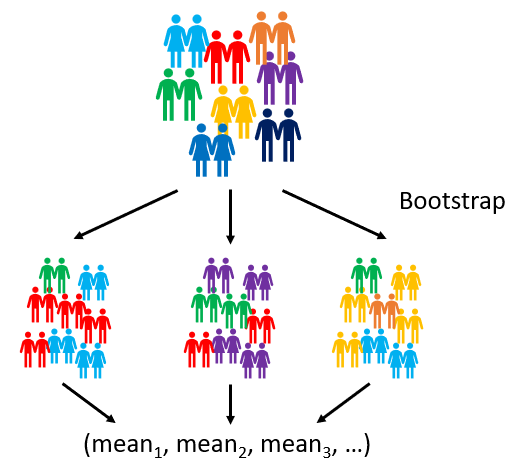
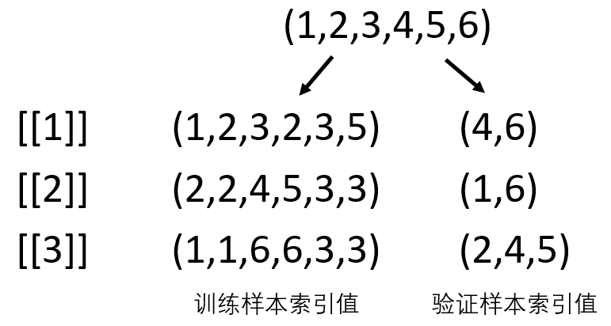

```{r setup, include=FALSE}
library(learnr)
knitr::opts_chunk$set(echo = FALSE)
```

## 第1章 基本介绍

### 1.1 命名

```{r 1-1-naming, echo=FALSE}
question("下列哪些命名方式不符合变量命名规范",
  answer("var_name <- '小赵'"),
  answer("varName <- '小钱'"),
  answer("2var_name <- '小孙'", correct = TRUE),
  answer("_var_name <- '小李'", correct = TRUE),
  answer("var_Name <- '小周'"),
  answer(".var_Name <- '小吴'"),
  answer("var@name <- '小王'", correct = TRUE),
  answer(".2var_name <- '小刘'", correct = TRUE),
  allow_retry = TRUE,
  incorrect = "答案不完全正确"
)
```
```{r 1-2-naming, echo=FALSE}
question("在上题中，如果输入`var_name`，将返回什么值？",
  answer("小赵", correct = TRUE),
  answer("小钱"),
  answer("小周"),
  answer("NULL"),
  allow_retry = TRUE
)
```

### 1.2 向量的缺失值处理
```{r 1-2-na-exercise, exercise=TRUE}
container_1 <- c(NA, NULL, NA, NaN) # 请勿修改此代码
container_2 <- c(10, NA, NULL, NaN, 20, 30) # 请勿修改此代码

#### 在此部分之后书写代码，回答下面问题 ####
```
```{r 1-2-na-sum, echo=FALSE}
question("下列说法正确的是：",
  answer("`sum(container_1)`得到的结果是0。"),
  answer("`container_1`的长度是4。"),
  answer("`container_2`的长度是5。", correct = TRUE),
  answer("在排除缺失值的情况下，计算得到`container_2`的均值为20", correct = TRUE),
  allow_retry = TRUE
)
```

### 1.3 正则表达式
```{r 1-3-regex, echo=FALSE}
question("正则表达式 `^[a-z0-9_-]{3,6}$` 能够匹配的字符串为：",
  answer("Ab87"),
  answer("time_2", correct = TRUE),
  answer("ok"),
  answer("xyz-ss", correct = TRUE),
  allow_retry = TRUE
)
```
```{r 1-3-regex2, echo=FALSE}
question("正则表达式 `\\w?(grip)\\s*\\d{4}` 能够匹配的字符串为：",
  answer("cn_grip 2014", correct = TRUE),
  answer("cngrip_2014"),
  answer("grip 2014", correct = TRUE),
  answer("Grip 2014"),
  answer("grip14"),
  answer("agrip  1914", correct = TRUE),
  allow_retry = TRUE
)
```

### 1.4 向量元素提取
给定`month_var`向量，从第2个元素开始，每隔2个位置提取一个元素，直至向量结束。

比如：给定向量`c(1,2,3,4,5,6)`，最终生成的向量应该为`c(2,5)`。

请在下框中完成代码，以实现上述功能。
```{r 1-4-element-selection, exercise=TRUE}
#### 请勿修改此部分代码 ####
month_var <- month.abb # 创建向量

#### 在此之后编写代码 ####

```

```{r 1-4-element-selection-hint}
"使用 seq() 函数"
```

### 1.5 循环
使用循环语句对`var_matrix`矩阵按**行**求和。

例：输入矩阵为:
$$\begin{bmatrix}
0&1&1\\
1&0&0\\
\end{bmatrix}$$

输出结果为：

`第1行的总和为：2`

`第2行的总和为：1`

```{r 1-5-loop, exercise=TRUE}
#### 请勿修改此部分代码 ####
var_matrix <- matrix(seq(1:6), nrow=3) # 创建矩阵

#### 在此之后编写代码 ####

```

```{r 1-5-loop-hint}
"使用 for 或 while 循环求和"
```

### 1.6 总体均值及标准误的推断
bootstrap抽样是有放回的重抽样方式，可以用于统计推断。以总体均值和标准误的推断为例，具体操作为，在每一轮 bootstrap 抽样中，从原始样本中**有放回地随机抽取**样本至<u>原有样本量大小</u>，组成新样本，计算该样本的样本均值，保存至向量中。经过k轮抽样，一共能生成 k 个样本均值数据，再基于生成的样本均值数据，计算均值即为总体均值，计算标准差即为标准误。请定义一个 bootstrap_inference 函数，使其能返回 k 轮 bootstrap 抽样后推断BMI的总体均值及标准误。

```{r bs-mean, echo = FALSE, out.width = "50%", out.height = "50%"}

```

```{r 1-6-bootstrap-inference, exercise=TRUE}
#### 请勿修改此部分代码 ####
set.seed(1) # 设置随机种子
bmi_data <- rnorm(30, mean=22, sd=2) # 创建输入数据

#### 在此之后编写代码 ####
bootstrap_inference <- function(){}

# 创建好 bootstrap_inference 后，基于 bmi_data 输出 100 轮 bootstrap 抽样生成的总体均值及标准误

```

```{r 1-6-bootstrap-inference-hint}
"使用 sample() 函数随机抽样并计算新样本均值进行存储"
```

### 1.7 bootstrap抽样-索引值
在建模过程中，遇到样本量较小的情况时，也可以采用bootstrap抽样方法扩充样本量。具体操作为，在每一轮bootstrap抽样中，从原始样本中**有放回地随机抽取**样本至<u>原有样本量大小</u>，组成*训练样本*进行建模，并将**未被抽到**的样本当做*验证样本*进行模型评价。其中就需要根据索引值确定训练样本与验证样本。请定义一个bootstrap_idx函数，使其能返回k轮bootstrap抽样生成的索引值列表。每个列表元素为一轮抽样的结果，该结果分别存储了训练样本与验证样本的索引值。

```{r bs-index, echo = FALSE, out.width = "50%", out.height = "50%"}

```

```{r 1-7-bootstrap-index, exercise=TRUE}
#### 请勿修改此部分代码 ####
set.seed(1) # 设置随机种子
input_index <- seq(10) # 创建输入索引值

#### 在此之后编写代码 ####
bootstrap_idx <- function(){}

# 创建好 bootstrap_idx 后，基于 input_index 输出2轮bootstrap抽样生成的训练样本与验证样本索引值

```

```{r 1-7-bootstrap-index-hint}
"想想看如何处理重复值以及如何分别存储索引值"
```

## 第2章 数据读取与预处理
### 2.1 excel文件读取
在excel文件读取的章节中，我们学习了如何读取一个excel中的所有工作表。现在请将那部分代码改写成一个函数`multi_reader()`（包含“文件”以及“工作表”两个参数），使其能读取指定excel文件的指定工作表并返回一个列表，列表中的各个元素名称为对应的工作表名称。
```{r 2-1-excel, exercise=TRUE}
# 载入readxl包


# 完成multi_reader()函数
multi_reader <- function(){}

# 使用 multi_reader() 函数读取 goods.xlsx 文件中2000年之后的所有工作表并返回一个列表
# 注：2000年之后的工作表必须R自动查找完成，不能手动输入
```

### 2.2 变量的拆分
由于数据来源不同，在进行变量拆分时，我们有时会遇到分隔符不统一的情况，这时应该如何拆分变量呢？
```{r 2-2-separate, exercise=TRUE}
# 载入tidyverse包


# 读取darwin数据


# 将 region 变量拆分为 state 和 city
```

### 2.3 宽数据转为长数据
将下方数据框转为长数据，目标变量为包含`x`和`abc`的变量，新生成`var`变量收纳元素`x`和`abc`，新生成`wave`变量收纳`x`和`abc`变量的数字。新生成`value`变量收纳目标变量的值。

注意：数字前的分隔符`-`不能被收纳进任何变量。
```{r 2-3-wider-longer, exercise=TRUE, message=FALSE}
#### 请勿修改此部分代码 ####
set.seed(1)
id = seq(1,6)
sex = c(rep(c("M","F"), times=3))
x_11 = rnorm(6, 10, 2)
x_12 = rnorm(6, 10, 2)
x_13 = rnorm(6, 10, 2)
abc2011 = rnorm(6, 10, 2)
abc2012 = rnorm(6, 10, 2)
abc2013 = rnorm(6, 10, 2)

df <- data.frame(id, sex, x_11, x_12, x_13, abc2011, abc2012, abc2013)

#### 在此之后编写代码 ####
# 载入tidyverse包

# 将 df 中的 x 和 abc 变量转为长数据格式
```

### 2.4 按条件创建变量
根据df_bmi数据框中受试者的国别以及BMI数据进行BMI分类。国内外的BMI评价标准如下:

|国内BMI标准|欧美BMI标准|BMI分类|
|:---|:---|:---|
|BMI<18.5|BMI<18.5|体重过低|
|18.5<=BMI<24|18.5<=BMI<25|体重正常|
|24<=BMI<28|25<=BMI<30|超重|
|BMI>=28|BMI>=30|肥胖|

```{r 2-4-conditioning, exercise=TRUE}
#### 请勿修改此部分代码 ####
set.seed(1)
df_bmi <- data.frame(
  id = 1:16,
  country = rep(c("China", "UK", "Canada", "US"), times=4),
  bmi = round(runif(16, min=16, max=35), 1)
)

#### 在此之后编写代码 ####
# 载入tidyverse包
library(tidyverse)

# 基于df_bmi数据框的country和bmi，创建bmi_class变量
df_bmi %>% 
  mutate(
    bmi_class = case_when(
      bmi<18.5 ~ "体重过低",
      (country=="China" & bmi<24) | (country!="China" & bmi<25) ~ "体重正常",
      (country=="China" & bmi<28) | (country!="China" & bmi<30) ~ "超重",
      (country=="China" & bmi>=28) | (country!="China" & bmi>=30) ~ "肥胖"
    )
  )
```

### 2.5 数据预处理综合练习
完成下列要求：
1. 读取`data`文件夹中所有以"grip"开头的csv文件并合并为一个数据框。
2. 移除所有`grip`值都为空的记录。
3. 在每一行记录中，将第一条非空的`testdate`和`grip`值分别放入`testdate_1`和`grip_1`变量中。
4. 在每一行记录中，将第二条非空的`testdate`和`grip`值分别放入`testdate_2`和`grip_2`变量中。
5. 在每一行记录中，将第三条非空的`testdate`和`grip`值分别放入`testdate_3`和`grip_3`变量中。
6. 创建一个变量`age`，该变量的数值为第一次测试时的年龄（精确至整数）。
7. 使用`summarise()`函数获得`grip_1`和`grip_2`变量的均值。

```{r 2-5-preprocess, message=FALSE}
#### 加载包后开始处理数据 ####

```