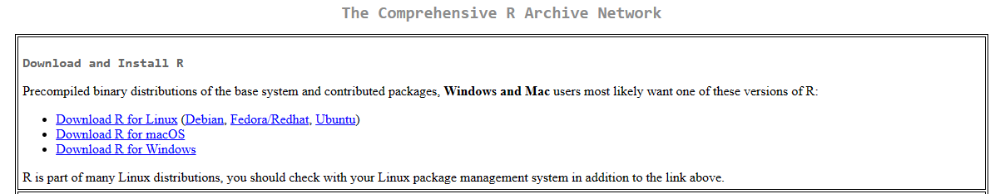
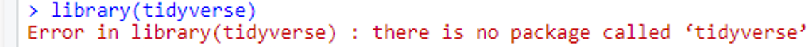

--- 
title: "R数据分析入门"
author: "Lingxiao HE"
date: "`r Sys.Date()`"
output: 
  # pdf_document: default
  html_document: default
documentclass: book
bibliography:
- book.bib
- packages.bib
description: |
  This is a textbook for a quick start on data analysis in R.
link-citations: true
site: bookdown::bookdown_site
---

# 本书说明{-}
- 本教材旨在帮助大家快速入门R数据分析。通过学习本教材，希望您能：
  - 阅读R代码
  - 掌握基本的R代码编写
  - 使用R读取和处理数据
  - 使用R进行数据可视化
  - 使用R进行常规的统计分析
<br></br>

## 软件准备{-}
- 在开始学习前，请先安装R与RStudio：
  1. [R下载链接](https://cran.r-project.org/mirrors.html)：点击任意站点，进入后，选择下载与操作系统匹配的R软件。
  
  
  2. [RStudio下载链接](https://posit.co/download/rstudio-desktop/) 
  <br></br>

***注意***：
<li>编写R代码时，所有的代码符号均为英文标点符号。</li>
<li>`#`是R中的注释符（快捷键为`Shift`+`Ctrl`+`c`），运行时不会执行`#`这一行的代码，通常被用作<u>代码注释</u>或者<u>特定代码的测试</u>。</li>
<li>在控制台（Console）输入 `?`+函数 可以获取函数的详细介绍。</li>

[练习题链接](https://github.com/LXHe/a-quick-start-on-data-analysis-in-r/blob/main/exercise)

## R包的安装与调用{-}
R之所以广受欢迎，很大一个原因就是它拥有种类繁多的“包”以满足我们的多种需求。尽管R自带一些功能强大的“包”，但是我们在需要的时候还得额外安装“包”，否则，调用包就会报错。

这时就需要用到`install.packages()`函数。例如，当我们需要安装***tidyverse***包时，可以输入`install.packages("tidyverse")`。


我们如果需要使用某一个“包”，则需要在开始时使用`library()`函数调用它。例如，我们在安装完***tidyverse***包后，调用它时可以输入 `library(tidyverse)`。

有时我们会在一个项目中调用多个包，而有些包里的函数会出现**重名**的情况，这时，后调用的“包”将覆盖先前加载“包”的功能。如果我们需要使用特定包的某个重名函数，可以输入`包::函数`。例如***tseries***和***chron***包都含有`is.weekend()`函数，如果要调用***chron***包的`is.weekend()`函数，则可以写成`chron::is.weekend()`。

当我们不清楚某个“包”是否有安装，可以使用`if (!require(包)){install.packages("包")}`，这个代码的含义是，检查特定的包是否存在，如果不存在，将安装它。比如，检查***tidyverse***包是否存在，如果不存在则安装它，可以写成 `if (!require(tidyverse)){install.packages("tidyverse")}`

```{r include=FALSE}
# automatically create a bib database for R packages
knitr::write_bib(c(
  .packages(), 'bookdown', 'knitr', 'rmarkdown'
), 'book.bib')
```
